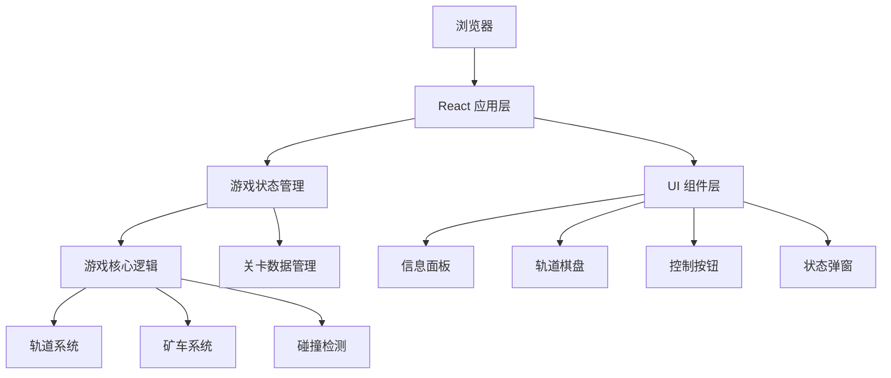

## 1. 架构设计

本项目为纯前端应用，采用 React 单页应用架构，所有游戏逻辑在客户端运行，无需后端服务。



## 2. 技术描述

- **前端框架**: React@18 + TypeScript
- **构建工具**: Vite@5
- **样式方案**: TailwindCSS@3
- **状态管理**: React Hooks (useState, useEffect, useCallback, useRef)
- **动画方案**: CSS Transitions + Framer Motion
- **数据持久化**: localStorage (保存最高分)
- **无需后端服务，无需数据库**

## 3. 核心模块设计

### 3.1 类型定义

```typescript
// 方向类型
type Direction = 'up' | 'down' | 'left' | 'right';

// 矿石颜色
type OreColor = 'red' | 'blue' | 'yellow';

// 格子类型
type CellType = 'track' | 'switch' | 'entrance' | 'warehouse' | 'empty';

// 道岔方向配置
interface SwitchConfig {
  direction1: Direction;  // 第一种方向
  direction2: Direction;  // 第二种方向
  current: 0 | 1;         // 当前选择
}

// 格子配置
interface Cell {
  type: CellType;
  switchConfig?: SwitchConfig;
  color?: OreColor;       // 仓库颜色
  entranceDirection?: Direction;  // 入口方向
}

// 矿车
interface Cart {
  id: number;
  x: number;
  y: number;
  color: OreColor;
  direction: Direction;
  moving: boolean;
}

// 关卡配置
interface Level {
  id: number;
  name: string;
  description: string;
  grid: Cell[][];          // 6x6 网格
  entrances: { x: number; y: number; direction: Direction }[];
  warehouses: { x: number; y: number; color: OreColor }[];
  spawnInterval: number;   // 矿车生成间隔(ms)
  moveInterval: number;    // 矿车移动间隔(ms)
  targetScore: number;     // 目标分数
  targetDeliveries: number; // 目标配送数
  timeLimit: number;       // 时间限制(秒)
}

// 游戏状态
type GameStatus = 'idle' | 'playing' | 'paused' | 'won' | 'lost';
```

### 3.2 游戏核心逻辑模块

| 模块名称 | 功能描述 | 关键函数 |
|---------|---------|---------|
| 轨道系统 | 管理 6×6 网格轨道和道岔状态 | `switchTrackDirection`, `getNextPosition` |
| 矿车系统 | 管理矿车生成、移动、销毁 | `spawnCart`, `moveCart`, `removeCart` |
| 碰撞检测 | 检测矿车相撞、驶出轨道、到达仓库 | `checkCollision`, `checkWarehouse`, `checkOutOfBounds` |
| 分数系统 | 计算得分、判断胜负 | `addScore`, `checkWinCondition`, `checkLoseCondition` |
| 关卡系统 | 管理关卡数据和切换 | `getLevel`, `nextLevel`, `restartLevel` |

### 3.3 组件结构

```
src/
├── App.tsx               # 主应用组件
├── main.tsx              # 入口文件
├── types/
│   └── game.ts           # 类型定义
├── data/
│   └── levels.ts         # 关卡配置数据
├── hooks/
│   └── useGameEngine.ts  # 游戏引擎 Hook
├── components/
│   ├── GameBoard.tsx     # 游戏棋盘
│   ├── Cell.tsx          # 单元格组件
│   ├── Cart.tsx          # 矿车组件
│   ├── InfoPanel.tsx     # 信息面板
│   ├── ControlButtons.tsx # 控制按钮
│   └── StatusModal.tsx   # 状态弹窗
└── utils/
    └── gameLogic.ts      # 游戏逻辑工具函数
```

## 4. 游戏规则实现

### 4.1 矿车移动规则
- 矿车按固定节奏（`moveInterval`）自动移动
- 移动前检查前方格子类型
- 遇到道岔时，按道岔当前方向转向
- 遇到仓库时，检查颜色是否匹配
- 遇到边界或空轨道时，判定失败

### 4.2 胜负判定
**胜利条件**（满足任一即可）：
- 分数达到 `targetScore`
- 成功配送数达到 `targetDeliveries`

**失败条件**（满足任一即可）：
- 矿车送到错误颜色的仓库
- 矿车驶出轨道
- 两辆矿车相撞
- 倒计时结束未达成目标

### 4.3 关卡设计（3个难度递增）

**关卡1 - 新手训练**
- 简单的直线轨道，2个仓库，矿车生成间隔长
- 目标：配送10个矿石，时间120秒

**关卡2 - 道岔挑战**
- 引入多个道岔，3个仓库，矿车速度加快
- 目标：配送20个矿石，时间150秒

**关卡3 - 调度大师**
- 复杂轨道网络，多个入口，矿车生成密集
- 目标：配送30个矿石，时间180秒

## 5. 响应式布局

| 断点 | 棋盘尺寸 | 按钮大小 | 布局 |
|------|---------|---------|------|
| ≥768px (桌面) | 540×540px | 48px高 | 三栏布局：信息面板+棋盘+控制区 |
| <768px (移动) | 90vw×90vw | 56px高 | 垂直布局：信息面板在上，棋盘居中，按钮在下 |
